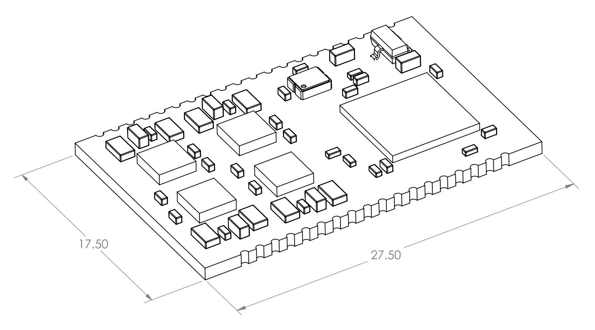

# 4 axis GRBL firmware for Kurokesu SCE-2 module

# Ordering
Order [SCE2-M controller](https://www.kurokesu.com/shop/SCE2-M)

# Documentation
More detailed documentation is on [Kurokesu knowledge base pages](https://wiki.kurokesu.com/shelves/motion-controllers)

# GRBL notice
This repository is based on [usbcnc grbl](https://github.com/usbcnc/grbl) which in turn is based on [native grbl 1.1f](https://github.com/gnea/grbl) 

# Dimensions

