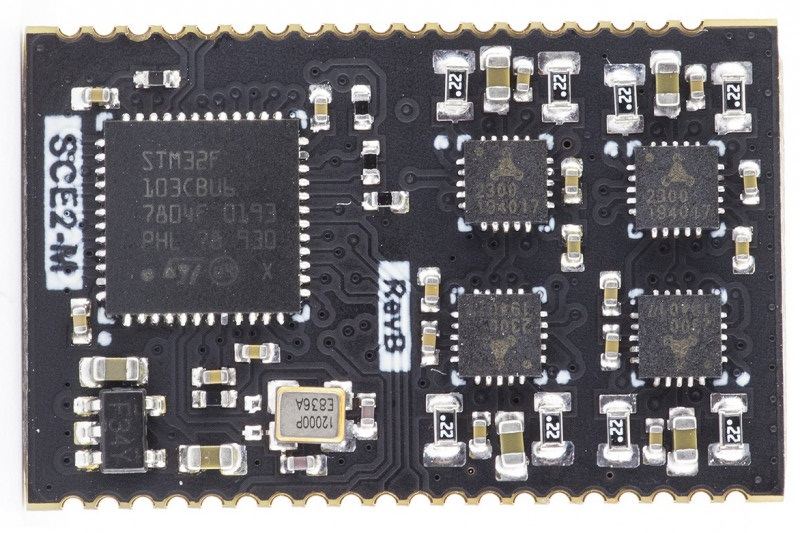

# 4 axis GRBL firmware for Kurokesu SCE-2 module

SCE2-M is a fully integrated stepper motor controller module for digital control for limited space applications. Designed for small 3D printers, laser cutters/engravers, CNC mills, pick and place machines, robots, test fixtures, and other motorized devices. SCE2-M module is the smallest motor controller that requires no external components and runs industry-standard g-code processor with linear interpolation control open-source firmware. 

# Ordering
Order [SCE2-M controller](https://www.kurokesu.com/shop/SCE2-M)

# Documentation
More detailed documentation is on [Kurokesu knowledge base pages](https://wiki.kurokesu.com/shelves/motion-controllers)

# GRBL notice
This repository is based on [usbcnc grbl](https://github.com/usbcnc/grbl) which in turn is based on [native grbl 1.1f](https://github.com/gnea/grbl) 

# Dimensions

