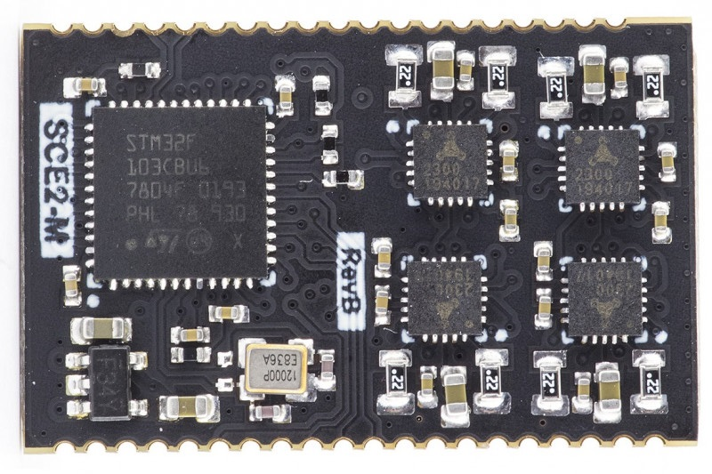
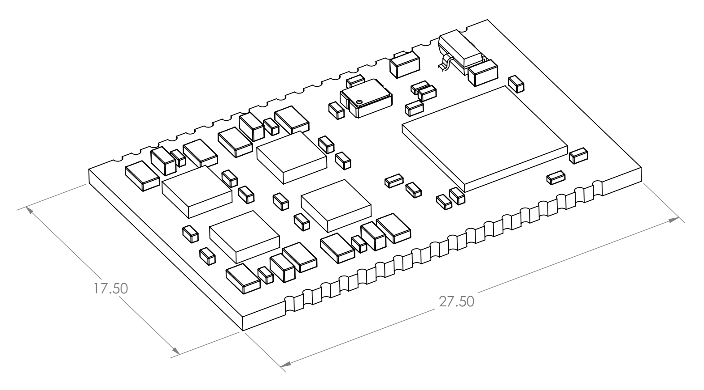

# 4 axis GRBL firmware for Kurokesu SCE-2 module

SCE2-M is a fully integrated stepper motor controller module for digital control for limited space applications. Designed for small 3D printers, laser cutters/engravers, CNC mills, pick and place machines, robots, test fixtures, and other motorized devices. SCE2-M module is the smallest motor controller that requires no external components and runs industry-standard g-code processor with linear interpolation control open-source firmware. 



# Ordering
Order [SCE2-M controller](https://www.kurokesu.com/shop/SCE2-M)

# Documentation
More detailed documentation is on [Kurokesu knowledge base pages](https://wiki.kurokesu.com/shelves/motion-controllers)

# GRBL notice
This repository is based on [usbcnc grbl](https://github.com/usbcnc/grbl) which in turn is based on [native grbl 1.1f](https://github.com/gnea/grbl)<br>

# Dimensions


# Getting Started

## Install Build Tools

Before you can build the bootloader and firmware, you need to set up your development environment. Below are the steps for installing the necessary tools on **Windows**.

### 1. CMake
CMake is a build automation tool that helps manage the build process of the project.

- **Download CMake**: [https://cmake.org/download](https://cmake.org/download)
- Follow the installation instructions and ensure that CMake is added to your system's `Path` environment variable.

#### Test CMake Installation:
Open a terminal and run:
```bash
cmake --version
```
If installed correctly, the CMake version will be displayed.

---

### 2. Ninja Build System
Ninja is a small, fast build system used by the project.

- **Download Ninja**: [https://github.com/ninja-build/ninja/releases](https://github.com/ninja-build/ninja/releases)
- Add the Ninja executable to your `Path` environment variable so you can run it from the command line.

#### Test Ninja Installation:
Open a terminal and run:
```bash
ninja --version
```
You should see the Ninja version output if installed correctly.

---

### 3. GNU Arm Toolchain
The STM32 bootloader and firmware project requires the `arm-none-eabi-gcc` toolchain for cross-compiling for ARM-based microcontrollers.

- **Download ARM Toolchain**: [https://developer.arm.com/downloads/-/arm-gnu-toolchain-downloads](https://developer.arm.com/downloads/-/arm-gnu-toolchain-downloads)
- After installing the toolchain, add it to your system’s `Path` environment variable so you can use commands like `arm-none-eabi-gcc` from anywhere.

#### Test GNU Arm Toolchain Installation:
Open a terminal and run:
```bash
arm-none-eabi-gcc --version
```
This should print the version of the ARM compiler.

---

### 4. Python
Python intelhex package is used by cmake for merging bootloader and application hex files. 

- **Download Python**: [https://www.python.org/downloads/](https://www.python.org/downloads/)
- During installation, ensure you check the option to add Python to the `Path` environment variable.
- The [intelhex](https://pypi.org/project/intelhex) pip package is used for merging hex files. It is automatically installed by `cmake`. But can also be installed manually:
```bash
pip install -r ./requirements.txt
```

#### Test Python Installation:
Open a terminal and run:
```bash
python --version
```
You should see the Python version. Additionally, test `pip`:
```bash
pip --version
```

---

### 5. Install Chocolatey
The bootloader project uses a `Makefile` to control its build process. To successfully build the bootloader, you need the `make` utility. We recommend installing the Chocolatey package manager for Windows, which simplifies the installation of `make`.

- **Install Chocolatey**: [Follow the instructions here](https://chocolatey.org/install) or run the following command in `PowerShell`:
    ```bash
    Set-ExecutionPolicy Bypass -Scope Process -Force; [System.Net.ServicePointManager]::SecurityProtocol = [System.Net.ServicePointManager]::SecurityProtocol -bor 3072; iex ((New-Object System.Net.WebClient).DownloadString('https://community.chocolatey.org/install.ps1'))
    ```

#### Test Chocolatey Installation:
Open a terminal and run:
```bash
choco --version
```
You should see the Chocolatey version output.

---

### 6. Install Make
After installing Chocolatey, use it to install `make`:

- **Command**:
    ```bash
    choco install make
    ```

- Ensure the path to `make` (usually `chocolatey\lib\make\tools\install\bin`) is added to your `Path` environment variable to use the `make` command globally.

#### Test Make Installation:
Open a terminal and run:
```bash
make --version
```
If installed correctly, the Make version will be displayed.

---

## Install DFU Utilities

For performing device firmware upgrades via the USB bootloader, `dfu-util` is required. This tool is also used to generate `.dfu` files containing firmware updates.

- **Download dfu-util**: [https://dfu-util.sourceforge.net/releases/](https://dfu-util.sourceforge.net/releases/)
- After downloading ensure the `dfu-util` executable is added to your `Path` environment variable so it can be accessed from the command line.

#### Test dfu-util Installation:
Open a terminal and run:
```bash
dfu-util --version
```
You should see the version output if the installation was successful.

## Build the project

- `cmake --build .\build\release --`
